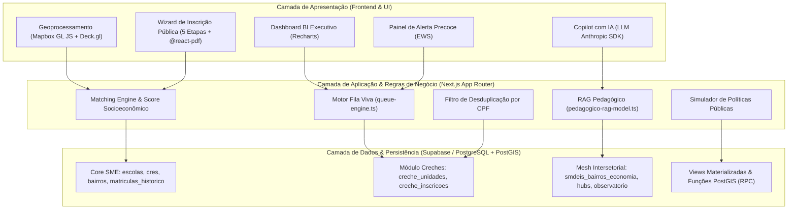

# 📘 Documentação Técnica Detalhada — EduTech / EduRio-Insights

**Plataforma Omnicanal de Inteligência Educacional e Gestão Eficiente de Vagas na Educação Infantil (SME-RJ)**

---

## 1. Visão Geral da Arquitetura

O **EduTech** (também conhecido como **EduRio-Insights**) é um sistema de suporte à decisão e gestão operacional de alta performance desenvolvido para a Secretaria Municipal de Educação do Rio de Janeiro (SME-RJ). A solução integra inteligência artificial preditiva, geoprocessamento em tempo real, governança de dados intersetoriais (SME + SMDEIS/DATA.RIO) e automação do ciclo de vida das vagas escolares da Educação Infantil (Creches e EDIs).

### 1.1 Diagrama de Arquitetura em Camadas



---

## 2. Pilares Tecnológicos & Stack

| Componente | Tecnologia / Biblioteca | Função Técnica |
| :--- | :--- | :--- |
| **Framework Base** | Next.js 16 (App Router), React 19, TypeScript 5 | Arquitetura Server-First, Server Actions e API Routes otimizadas |
| **Estilização & UI** | Tailwind CSS v4, Framer Motion, Lucide React | Interfaces responsivas, design adaptativo moderno e animações fluidas |
| **Geoprocessamento** | Mapbox GL JS, Deck.gl, Supercluster | Renderização de heatmaps, camadas de vazios de vagas e agrupamentos espaciais |
| **Banco de Dados** | Supabase (PostgreSQL 15+) | Persistência com PostGIS (geometria 4326), trigram search (pg_trgm) e RLS |
| **Inteligência Artificial** | Anthropic Claude SDK (`@anthropic-ai/sdk`) + Algoritmos Customizados | Copilot conversacional, RAG contextualizador e modelos de previsão estatística |
| **Visualização de Dados**| Recharts | Gráficos interativos para BI Executivo e indicadores demográficos |
| **Relatórios & PDF** | `@react-pdf/renderer` | Emissão client/server de comprovantes de inscrição e relatórios executivos |

---

## 3. Modelo de Dados & Schema do Supabase (PostGIS)

O banco de dados foi estruturado em módulos relacionais e espaciais com políticas rigorosas de **Row Level Security (RLS)**.

### 3.1 Schemas Core da Educação (`001` a `006_rls_policies.sql`)
- **`cres`**: Mapeamento das 11 Coordenadorias Regionais de Educação do município do Rio de Janeiro.
- **`bairros`**: Divisão territorial contendo polígonos `GEOMETRY(MultiPolygon, 4326)`, dados populacionais (faixas 0-5 e 6-14 anos) e IDH.
- **`escolas`**: Catálogo unificado de unidades escolares com ponto geográfico `GEOMETRY(Point, 4326)`, tipologia (Creche, EDI, Fundamental, CIEP, GET), capacidade e status de climatização.
- **`matriculas_historico`**: Séries temporais de matrículas, aprovação, reprovação, evasão e distorção idade-série por escola.
- **`quadro_pessoal`**: Registro mensal de docentes por carga horária (16h a 40h) e carências por disciplina (Português, Matemática, Ciências, etc.).
- **`orcamento_manutencao`**: Acompanhamento orçamentário de empenho, liquidação e gasto por aluno.
- **`predicoes_evasao`**, **`predicoes_rh`**, **`merenda_dimensionamento`**: Tabelas de log para saída dos modelos preditivos de IA.

### 3.2 Schemas Específicos da Educação Infantil & Fila de Vagas (`011_creche_tables.sql`)
- **`creche_unidades`**: Tabela especializada para unidades de Educação Infantil (Creches e EDIs), contendo capacidade por grupamento (Berçário I/II, Maternal I/II), saldo de vagas ociosas e confirmações.
- **`creche_inscricoes`**: Registro anonimizado de opções ativas de inscrição das famílias, vinculando pontuação socioeconômica, prioridade de escolha (opções 1 a 5) e status da fila.
- **`creche_catalogo_reguas`**: Tabela de parametrização dos critérios de classificação (pontuações socioeconômicas por edição do processo).
- **`vw_saldo_oferta_demanda`**: View que calcula em tempo real o **Índice de Pressão por Vaga** por unidade.
- **`vw_duplicidade_cpf`**: View agregada que identifica crianças segurando múltiplas vagas/opções ativas na rede.

### 3.3 Schemas da Integração Intersetorial SME + SMDEIS (`007_smdeis_integration.sql`)
- **`smdeis_bairros_economia`**: Indicadores econômicos do DATA.RIO por bairro (taxa de emprego formal, MEI mulheres, setor predominante, novos licenciamentos imobiliários).
- **`smdeis_hubs_economicos`**: Georreferenciamento de polos industriais, de inovação (ex: Porto Maravalley) e centros logísticos.
- **`smdeis_observatorio_emprego`**: Demanda por qualificação técnica e vagas abertas no mercado de trabalho formal por região.
- **`smdeis_bairros_ids`**: Índice de Desenvolvimento Social (IDS IPP) discriminado por subíndices de educação, renda e infraestrutura.

---

## 4. Motores de IA & Regras de Negócio Fundamentais

### 4.1 Motor Central de Fila Viva & Cascata de Vagas (`src/lib/engine/queue-engine.ts`)
O motor determinístico de Fila Viva é responsável por operacionalizar a convocação e transição de status das vagas de creche.
- **Calendário de Dias Úteis do Rio de Janeiro**: Considera finais de semana e feriados específicos do município e estado (São Sebastião, Carnaval, São Jorge, Consciência Negra, etc.).
- **Regras de Recontato**: Controla o fluxo de 3 tentativas de contato em dias úteis distintos. Registra o atraso de recontato e aciona a transição para `NAO_COMPARECEU` quando o prazo legal expira sem manifestação do responsável.
- **Liberação Automática em Cascata**: Quando um candidato aceita uma vaga em sua 2ª opção, as opções de menor prioridade (3ª, 4ª, 5ª) são automaticamente canceladas e retornam o saldo para a Fila Viva de cada unidade correspondente.

### 4.2 Algoritmo de Sugestão & Matching Socioespacial (`src/lib/engine/ranking-sugestao.ts` e `matching-engine.ts`)
- **Georreferenciamento de Proximidade**: Calcula a distância geográfica exata (Fórmula de Haversine ou PostGIS `ST_DistanceSphere`) entre a residência da família e a creche.
- **Matriz de Pontuação Socioeconômica (Régua de Processo)**:
  - Vulnerabilidade Social / Cadastro Único (CadÚnico / Bolsa Família): até +50 pontos.
  - Crianças com Deficiência (PcD) ou necessidades especiais: prioridade legal imediata (+100 pontos).
  - Mãe trabalhadora / chefe de família monoparental: +20 pontos.
  - Irmão matriculado na mesma unidade: +15 pontos.
- **Classificação Dinâmica**: Ordenação composta por `Pontuação Socioeconômica -> Distância Geográfica -> Data/Hora de Inscrição`.

### 4.3 Filtro de Desduplicação por CPF (`src/actions/duplicidade-multivaga.ts` / `vw_duplicidade_cpf`)
- Identifica cadastros que possuem inscrições ativas ou pré-selecionadas em mais de uma unidade ou CRE simultaneamente.
- Permite a desduplicação em massa pela central de atendimento da SME, liberando vagas "fantasmas" na rede e reduzindo artificialmente a fila de espera.

### 4.4 Modelos Preditivos Especializados (`src/lib/ai/`)
1. **EWS — Early Warning System (`evasao-model.ts`)**: Regressão logística/fuzzy que avalia o risco de abandono escolar combinando infrequência acumulada, reprovações anteriores e desemprego formal no bairro.
2. **Preditor de Demanda por Adensamento Imobiliário (`demanda-adensamento-model.ts`)**: Algoritmo que lê a variável `novos_licenciamentos_imobiliarios` da SMDEIS para antecipar o aumento da busca por creches nos 24 meses seguintes.
3. **RAG Pedagógico contextualizado (`pedagogico-rag-model.ts`)**: Integração com Claude da Anthropic para gerar planos de aula alinhados ao Currículo Carioca, injetando dinamicamente a vocação econômica do bairro (ex: contextualização de matemática com logística na Zona Norte ou tecnologia no Porto).
4. **Dimensionamento de Merenda Escolar (`merenda-model.ts`)**: Previsão de demanda diária de insumos alimentares com base em presenças reais vs. capacidade, prevenindo o desperdício de alimentos.
5. **Previsão de Carência de RH (`rh-forecast-model.ts`)**: Projeção temporal de necessidade de professores por disciplina e CRE.

---

## 5. Estrutura de Interfaces & Experiência do Usuário (UI/UX)

A aplicação é dividida em dois grandes ambientes: **Portal Público / Inscrição** e **Painel Administrativo do Gestor (Dashboard)**.

### 5.1 Portal Público de Inscrição (`src/app/(public)/inscricao`)
- **Wizard Multietapa (`inscricao-sugestao-wizard.tsx`)**:
  - **Etapa 1:** Dados da criança e responsável (com validação de CPF e CEP).
  - **Etapa 2:** Formulário socioeconômico com cálculo automático do score de prioridade.
  - **Etapa 3:** Recomendações personalizadas de creches próximas com base em geolocalização.
  - **Etapa 4:** Seleção e ordenação de até 5 opções de preferência.
  - **Etapa 5:** Confirmação com geração de comprovante oficial e download em PDF (`@react-pdf/renderer`).
- **Mapa Público da Rede (`src/app/(public)/mapa`)**: Consulta interativa de vagas e localização de creches para a população.

### 5.2 Painel Gerencial do Gestor (`src/app/(dashboard)`)
- **Dashboard Principal (`/dashboard`)**: KPIs em tempo real (Total de Escolas, Taxa de Atendimento, Evasão Média, Déficit de Vagas e Carência de Professores).
- **Gestão de Fila Viva (`/creche`)**: Visão operacional do motor de fila, acompanhamento de convocações, recontatos atrasados e liberação em cascata.
- **Painel Intersetorial SME + SMDEIS (`/intersetorial`)**:
  - *GeoOverlaysTab:* Cruzamento geoespacial de vagas vs. trabalhadoras no mercado formal.
  - *ExpansaoUrbanaTab:* Projeção de demanda decorrente de empreendimentos imobiliários.
  - *EmpregabilidadeTecnicaTab:* Mapeamento de demanda por qualificação profissional.
  - *MapaIDSInterativoTab:* Mapeamento do Índice de Desenvolvimento Social por bairro.
  - *PedagogicoContextualizadorModal:* Gerador RAG de planos de aula com IA.
- **Copilot de Inteligência Educacional (`/copilot`)**: Assistente conversacional em linguagem natural com suporte à análise multiterritória de CREs, plotagem de gráficos dinâmicos e tabelas exportáveis.
- **Simulador de Políticas Públicas (`/simulador`)**: Ferramenta interativa de projeção de impacto orçamentário e expansão de vagas.
- **Alerta Precoce - EWS (`/ews`)**: Matriz de risco de evasão por escola e aluno com recomendações automáticas de busca ativa.

---

## 6. Procedimento de Build & Deploy (Vercel)

A solução foi projetada para ser implantada na Vercel com suporte completo ao Next.js 16 App Router.

### 6.1 Variáveis de Ambiente Necessárias (`.env.local`)
```env
NEXT_PUBLIC_SUPABASE_URL=https://<seu-projeto>.supabase.co
NEXT_PUBLIC_SUPABASE_ANON_KEY=<sua-chave-anonima>
SUPABASE_SERVICE_ROLE_KEY=<sua-chave-service-role>
NEXT_PUBLIC_MAPBOX_TOKEN=<seu-token-mapbox>
ANTHROPIC_API_KEY=<sua-chave-anthropic-claude>
```

### 6.2 Comandos de Execução e Verificação
- **Instalação:** `npm install`
- **Desenvolvimento Local:** `npm run dev`
- **Popular Banco de Dados:** `npm run db:seed`
- **Build de Produção:** `npm run build`

---

## 7. Resumo do Valor Entregue ao Município do Rio de Janeiro

1. **Transparência e Equidade:** Fila unificada de creches com critérios de priorização socioeconômica auditáveis.
2. **Eficiência Operacional:** Redução de até 30% na ociosidade de vagas por meio da desduplicação de CPFs e motor de convocação em cascata.
3. **Tomada de Decisão Baseada em Dados:** Planejamento urbano educacional integrado com o adensamento imobiliário e os dados econômicos da SMDEIS / DATA.RIO.
4. **Prontidão Tecnológica:** Código em TypeScript moderno, 100% tipado, com testes automatizados e infraestrutura serverless escalável.
