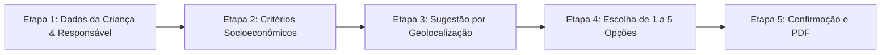

# 📖 Guia Completo do Usuário — Plataforma EduTech / EduRio-Insights

**Manual Operacional Simplificado para Gestores, Operadores e Secretários de Educação da Rede Municipal de Ensino do Rio de Janeiro (SME-RJ)**

---

## 1. Apresentação do Sistema & Como Acessar

Bem-vindo ao **EduTech (EduRio-Insights)**! Este sistema foi criado com o objetivo de facilitar o seu dia a dia na gestão, acompanhamento e distribuição de vagas nas **Creches** e **Espaços de Desenvolvimento Infantil (EDIs)** do Rio de Janeiro. 

Com esta plataforma, você pode:
- Acompanhar as filas de espera com total transparência e justiça social.
- Identificar crianças cadastradas em mais de uma unidade para liberar vagas "fantasmas".
- Convocar famílias dentro dos prazos legais considerando os feriados da cidade.
- Visualizar em mapas onde faltam vagas e onde há salas ociosas.
- Fazer perguntas em português simples para o assistente de inteligência artificial.

### 1.1 Credenciais de Acesso (Modo de Teste / Homologação)
* **Link de Acesso:** [https://edutech-steel-six.vercel.app/](https://edutech-steel-six.vercel.app/)
* **Usuário:** `juniorgoulart.rj@gmail.com`
* **Senha:** `123456`

---

## 2. Estrutura da Tela & Navegação Básica

Ao fazer login, você verá a tela dividida nas seguintes áreas principais:

```
+-----------------------------------------------------------------------------------+
| [LOGOTIPO SME-RIO]    [BARRA DE PESQUISA / NOTIFICAÇÕES]   [USUÁRIO] [MODO ESCURO] |
+------------------------------------+----------------------------------------------+
| MENU LATERAL NAVEGAÇÃO             | ÁREA DE TRABALHO PRINCIPAL                   |
|                                    |                                              |
| 📊 Painel Executivo                 | (Exibe o conteúdo, gráficos, tabelas e mapas |
| 📈 Indicadores & Relatórios        |  do menu selecionado)                        |
| 🏫 Gestão de Creches               |                                              |
| ✨ Assistente & Simulações         |                                              |
| 🌐 Dados Intersetoriais            |                                              |
| 🛡️ Alerta Precoce (EWS)            |                                              |
|                                    |                                              |
| [< Recolher Menu]                  |                                              |
+------------------------------------+----------------------------------------------+
```

1. **Barra Superior (Cabeçalho):**
   * **Notificações:** Alertas sobre convocações pendentes, atrasos de recontato ou relatórios novos.
   * **Alternador de Tema (Sol/Lua):** Permite mudar o fundo da tela entre Modo Claro (fundo branco) e Modo Escuro (fundo preto).

2. **Menu Lateral (Navegação):**
   * Contém todos os botões para acessar as ferramentas. Você pode clicar em **"Recolher"** na parte inferior para encolher o menu e ganhar mais espaço na tela.

---

## 3. Detalhamento dos Módulos, Menus e Funcionalidades

---

### 📊 MÓDULO 1: Painel Executivo
* **Onde fica:** Primeiro item do Menu Lateral (`/dashboard`).
* **Para que serve:** É a "tela inicial" da diretoria. Dá um panorama geral e imediato da situação da educação no município.
* **Objetivo:** Permitir que o gestor tome decisões rápidas logo no início do dia sem precisar procurar em relatórios extensos.

#### Funcionalidades dentro deste painel:
1. **Cartões de Resumo (KPIs em Tempo Real):**
   * **Total de Escolas / Creches Ativas:** Quantidade total de unidades atendendo na rede.
   * **Taxa de Evasão Média:** Porcentagem de alunos que deixaram de frequentar a escola.
   * **Déficit de Vagas:** Número estimado de crianças aguardando vaga na Fila de Espera.
   * **Carência de Professores:** Total de vagas docentes em aberto nas disciplinas principais.
2. **Gráfico de Evolução de Matrículas:** Mostra a tendência de crescimento ou queda de alunos matriculados nos últimos anos.
3. **Resumo por CRE (Coordenadoria Regional de Educação):** Tabela que compara os indicadores entre as 11 CREs da cidade.

---

### 📈 MÓDULO 2: Indicadores & Relatórios

---

#### 2.1 Menu: Relatórios Executivos (`/relatorios`)
* **Para que serve:** Central de emissão de relatórios oficiais para auditoria, reuniões de gabinete e órgãos de controle.
* **Objetivo:** Gerar documentos prontos e formatados em formato digital ou para impressão.

##### Funcionalidades:
* **Filtros de Período e Região:** Escolha a CRE desejada, o bairro ou o ano letivo.
* **Gerador de Relatórios em PDF:** Botão "Baixar Relatório Executivo em PDF". O sistema monta automaticamente um arquivo completo formatado contendo gráficos, tabelas de alunos e justificativas operacionais.
* **Exportação para Excel/CSV:** Permite baixar a tabela bruta de dados para enviar por e-mail ou fazer análises próprias.

---

#### 2.2 Menu: Análise da Fila (`/bi/fila`)
* **Para que serve:** Apresenta gráficos gerenciais profundos sobre o comportamento das filas de espera na Educação Infantil.
* **Objetivo:** Entender a evolução histórica da fila de creche e identificar em quais meses ocorrem os maiores picos de demanda.

##### Funcionalidades:
* **Gráfico de Linhas de Evolução Temporal:** Mostra se a fila está aumentando ou diminuindo ao longo dos meses.
* **Filtro por Grupamento:** Permite isolar a análise entre Berçário I (0 a 1 ano), Berçário II (1 a 2 anos), Maternal I (2 a 3 anos) e Maternal II (3 a 4 anos).
* **Taxa de Atendimento Regional:** Exibe qual porcentagem das solicitações de vaga foi atendida em cada bairro da cidade.

---

### 🏫 MÓDULO 3: Gestão de Creches (Operacional do Dia a Dia)

---

#### 3.1 Menu: Gestão da Fila (`/creche/gestao-fila`)
* **Para que serve:** É a principal ferramenta de trabalho do operador que gerencia as convocações e liga para as famílias.
* **Objetivo:** Garantir que nenhuma convocação fique parada e respeitar rigorosamente os prazos de atendimento da Prefeitura.

##### Funcionalidades Principais:
1. **Painel de Controle de Status da Fila:**
   * **Fila Ativa:** Lista de crianças aguardando convocação.
   * **Contatados:** Famílias que a equipe da prefeitura já tentou ligar/enviar mensagem.
   * **Selecionados / Confirmados:** Crianças que aceitaram a vaga e apresentaram documentos.
   * **Não Compareceu / Caducado:** Famílias que não responderam após 3 tentativas em dias úteis distintos.
2. **Contador de Dias Úteis do Rio de Janeiro:**
   * O sistema calcula automaticamente os prazos desconsiderando sábados, domingos e feriados municipais (como São Sebastião, Carnaval, Sexta-feira Santa e São Jorge).
3. **Botão de Registro de Tentativa de Contato:**
   * Permite clicar em "Registrar LIGAÇÃO" ou "Registrar WHATSAPP". O sistema grava o dia e a hora do contato.
4. **Automóvel de Cascata de Vagas:**
   * Quando o operador marca que a família **aceitou a vaga na 2ª opção**, o sistema automaticamente cancela a 3ª, 4ª e 5ª opções daquela criança, liberando imediatamente a vaga para o próximo da fila das outras creches.

---

#### 3.2 Menu: Mapa Oferta e Demanda (`/creche/mapa`)
* **Para que serve:** Um mapa interativo da cidade que compara onde estão as creches e onde estão as crianças na fila.
* **Objetivo:** Mostrar geograficamente os locais que precisam de abertura de novas turmas ou construções de EDIs.

##### Funcionalidades:
* **Filtro por Raio de Distância:** Exibe círculos no mapa mostrando a distância de 1 km ou 2 km em volta da casa da família.
* **Índice de Pressão (Cores de Alerta):**
  * 🔴 **Vermelho (Alta Pressão):** Creches com mais de 3 crianças disputando cada vaga.
  * 🟡 **Amarelo (Média Pressão):** Fila moderada.
  * 🟢 **Verde (Vagas Ociosas):** Creches com vagas sobrando que podem receber alunos de outros bairros.
* **Clique na Creche:** Ao clicar no ícone da creche no mapa, abre uma janela lateral com o nome da diretora, endereço completo, quantidade de salas climatizadas e telefone.

---

#### 3.3 Menu: Verificação de Duplicidades (`/creche/duplicidade`)
* **Para que serve:** Detector inteligente de cadastros repetidos ou crianças com múltiplas inscrições segurando vagas.
* **Objetivo:** Eliminar cadastros duplicados (mesmo CPF ou certidão) para limpar a fila real e evitar que uma única criança ocupe duas vagas ao mesmo tempo.

##### Funcionalidades:
* **Lista de Alertas de Duplicidade:** Tabela destacando crianças que possuem inscrição em mais de uma creche ou CRE diferente.
* **Botão "Unificar Cadastros":** Permite ao operador selecionar qual é a opção principal da família e cancelar a inscrição duplicada com apenas um clique.
* **Relatório de Vagas Liberadas:** Exibe quantas vagas "fantasmas" foram limpas na rede graças à verificação.

---

#### 3.4 Menu: Projeção de Demanda (`/creche/demanda-futura`)
* **Para que serve:** Algoritmo que calcula quantas vagas de creche o município precisará nos próximos 1 a 2 anos.
* **Objetivo:** Planejar o orçamento e a contratação de educadores antes que as crianças nasçam ou cheguem à idade escolar.

##### Funcionalidades:
* **Cruzamento com Nascidos Vivos:** Analisa os registros dos hospitais e maternidades da cidade para prever a quantidade de bebês que entrarão no Berçário no ano seguinte.
* **Alerta de Adensamento Urbano:** Indica bairros onde estão sendo construídos novos condomínios habitacionais (dados da SMDEIS) e onde haverá forte aumento de famílias com crianças pequenas.

---

#### 3.5 Menu: Simulação de Convocação (`/creche/convocacao`)
* **Para que serve:** Ferramenta que simula uma rodada de convocação geral antes de enviar os avisos reais às famílias.
* **Objetivo:** Evitar erros no processo de chamada e testar quantas crianças serão atendidas com as vagas disponíveis no mês.

##### Funcionalidades:
* **Percentual Estimatívo de Absenteísmo (Não Comparecimento):** O sistema avisa se em determinado bairro costuma haver alto índice de desistência, sugerindo chamar uma margem de reserva (ex: chamar 12 crianças para 10 vagas).
* **Botão "Executar Rodada de Convocação":** Confirma a chamada pública das crianças selecionadas no ranking.

---

### ✨ MÓDULO 4: Assistente Inteligente & Simulações

---

#### 4.1 Menu: Assistente de Dados - Copilot (`/copilot`)
* **Para que serve:** É um chat inteligente parecido com o WhatsApp onde você conversa diretamente com o sistema.
* **Objetivo:** Permitir que pessoas não técnicas façam perguntas em linguagem natural e recebam dados, gráficos e relatórios instantaneamente.

##### Como usar (Exemplos de Perguntas que você pode digitar):
* *"Qual é o déficit de vagas de creche na 4ª CRE?"*
* *"Compare a fila de espera entre a 1ª CRE e a 5ª CRE em um gráfico."*
* *"Quais creches do bairro Bangu possuem ar-condicionado instalado?"*
* *"Gere uma tabela com as 10 creches com maior taxa de evasão."*

##### Funcionalidades:
* **Geração Automática de Gráficos:** Se você pedir uma comparação, o assistente desenha um gráfico colorido na hora na tela.
* **Tabelas Baixáveis:** Todas as respostas contendo listas de escolas podem ser copiadas ou baixadas.

---

#### 4.2 Menu: Simulador de Cenários (`/simulador`)
* **Para que serve:** Laboratório virtual para o Secretário e equipe testarem "E se..." antes de gastar recursos públicos.
* **Objetivo:** Simular o impacto de abrir novas turmas, reformar creches ou fazer parcerias com creches conveniadas.

##### Funcionalidades:
* **Controles Deslizantes (Sliders):**
  * *Exemplo 1:* "E se abrirmos 200 novas vagas no bairro Campo Grande?" -> O simulador mostra quanto a fila vai cair e qual será o custo com professores e merenda.
  * *Exemplo 2:* "E se fizermos convênio com 5 creches comunitárias?" -> O simulador calcula o tempo de atendimento da fila.

---

### 🌐 MÓDULO 5: Dados Intersetoriais (SME + SMDEIS / DATA.RIO)
* **Onde fica:** Menu Lateral (`/intersetorial`).
* **Para que serve:** Integra os dados da Educação com a Secretaria de Desenvolvimento Econômico da cidade.
* **Objetivo:** Garantir vaga de creche prioritariamente para mães que trabalham ou estão estudando, fortalecendo a renda familiar.

#### Abas dentro deste painel:
1. **Aba "Mães Trabalhadoras & Vagas" (`GeoOverlaysTab`):**
   * Cruza no mapa o local onde há mais mães cadastradas no mercado formal / MEIs com os locais onde faltam creches.
2. **Aba "Expansão Urbana & Imóveis" (`ExpansaoUrbanaTab`):**
   * Mostra onde a prefeitura autorizou novos prédios residenciais, indicando a necessidade de preparar vagas no entorno.
3. **Aba "Qualificação & Emprego" (`EmpregabilidadeTecnicaTab`):**
   * Mapeia os cursos técnicos e vagas de emprego do bairro para direcionar ações educacionais.
4. **Aba "Índice de Desenvolvimento Social - IDS" (`MapaIDSInterativoTab`):**
   * Classifica as regiões da cidade por nível de vulnerabilidade social (Baixa, Média, Alta e Extrema).
5. **Modal "Gerador de Planos de Aula Contextualizado" (`PedagogicoContextualizadorModal`):**
   * Ferramenta para professores e coordenadores pedagógicos: Digite a matéria e a escola, e a IA gera um plano de aula baseado no **Currículo Carioca**, adaptado à realidade econômica do bairro (ex: trazendo exemplos de barcos e navios para escolas da Região Portuária, ou comércio para escolas da Zona Norte).

---

### 🛡️ MÓDULO 6: Alerta Precoce - EWS (`/ews`)
* **Para que serve:** Sistema de proteção ao estudante para evitar o abandono e a evasão escolar.
* **Objetivo:** Avisar a direção da escola ANTES que o aluno abandone os estudos.

#### Funcionalidades:
* **Termômetro de Risco de Evasão (Cores de Risco):**
  * 🔴 **Risco Crítico:** Aluno com muitas faltas não justificadas e histórico de reprovação.
  * 🟡 **Risco Moderado:** Aluno demonstrando queda na frequência.
  * 🟢 **Risco Baixo:** Frequência normal.
* **Botão "Gerar Ficha de Busca Ativa":** Cria um documento oficial para a equipe da escola visitar a família do aluno faltoso ou acionar o Conselho Tutelar.

---

### 📋 MÓDULO 7: Portal Público de Inscrição (Atendimento às Famílias)
* **Onde fica:** Endereço público `/inscricao`.
* **Para que serve:** Interface em 5 passos utilizada pelos pais (em casa ou no terminal de atendimento da creche) para realizar a inscrição da criança.

#### As 5 Etapas do Wizard de Inscrição:


1. **Etapa 1 (Dados Básicos):** Preenchimento de Nome, Data de Nascimento, CPF da criança e do responsável, CEP e Endereço.
2. **Etapa 2 (Critérios Socioeconômicos):** Pergunta se a família possui Bolsa Família / CadÚnico, se a criança possui deficiência (PcD) ou se a mãe trabalha fora. O sistema calcula a pontuação socioeconômica na hora.
3. **Etapa 3 (Sugestões por Mapa):** O sistema mostra no mapa as creches mais próximas da casa da família (raio de até 2 km).
4. **Etapa 4 (Escolha de Opções):** A família seleciona até 5 creches por ordem de preferência (1ª Opção, 2ª Opção, etc.).
5. **Etapa 5 (Comprovante Oficial):** Exibe o resumo da inscrição e disponibiliza o botão **"Baixar Comprovante de Inscrição em PDF"**, que pode ser impresso ou enviado por WhatsApp para os pais.

---

## 4. Glossário de Termos do Sistema

Para ajudar na operação diária, confira o significado dos termos mais usados no sistema:

* **CRE (Coordenadoria Regional de Educação):** Divisão administrativa da Secretaria de Educação do Rio de Janeiro. A cidade é dividida em 11 CREs.
* **EDI (Espaço de Desenvolvimento Infantil):** Unidade escolar da Prefeitura focada no atendimento de crianças de 0 a 5 anos.
* **Fila Viva:** Fila de espera dinâmica que se atualiza automaticamente em tempo real a cada convocação ou desistência.
* **Índice de Pressão:** Número que indica quantas crianças estão disputando cada vaga disponível em uma creche (ex: Pressão 2.5 significa que há 25 crianças para 10 vagas).
* **Cascata de Vagas:** Regra automática que cancela as opções menores de uma criança assim que ela consegue vaga em uma opção superior, liberando as outras creches imediatamente.
* **Desduplicação de CPF:** Processo de encontrar e corrigir cadastros repetidos da mesma criança.
* **Régua Socioeconômica:** Tabela de pontos que dá prioridade na fila para famílias de menor renda ou em situação de vulnerabilidade.

---

## 5. Dúvidas Frequentes & Boas Práticas

1. **O que fazer quando uma família não atende às ligações de convocação?**
   * Acesse o menu **Gestão da Fila** (`/creche/gestao-fila`).
   * Clique em **"Registrar Tentativa"**.
   * Faça pelo menos 3 tentativas em dias úteis diferentes. O sistema controlará a contagem dos dias automaticamente. Se o prazo vencer sem resposta, o sistema alterará o status para `Não Compareceu` e chamará o próximo candidato.

2. **Como saber se uma vaga foi liberada por duplicidade?**
   * Vá ao menu **Verificação de Duplicidades** (`/creche/duplicidade`).
   * O painel mostrará o histórico de cadastros unificados e quantas vagas retornar para a Fila Viva no mês.

3. **Posso usar o sistema no celular ou tablet?**
   * Sim! Toda a plataforma foi desenhada para funcionar perfeitamente em computadores de mesa, notebooks, tablets e smartphones.

---
*EduTech — Gestão Eficiente de Vagas na Educação | Prefeitura da Cidade do Rio de Janeiro / SME-RJ*
